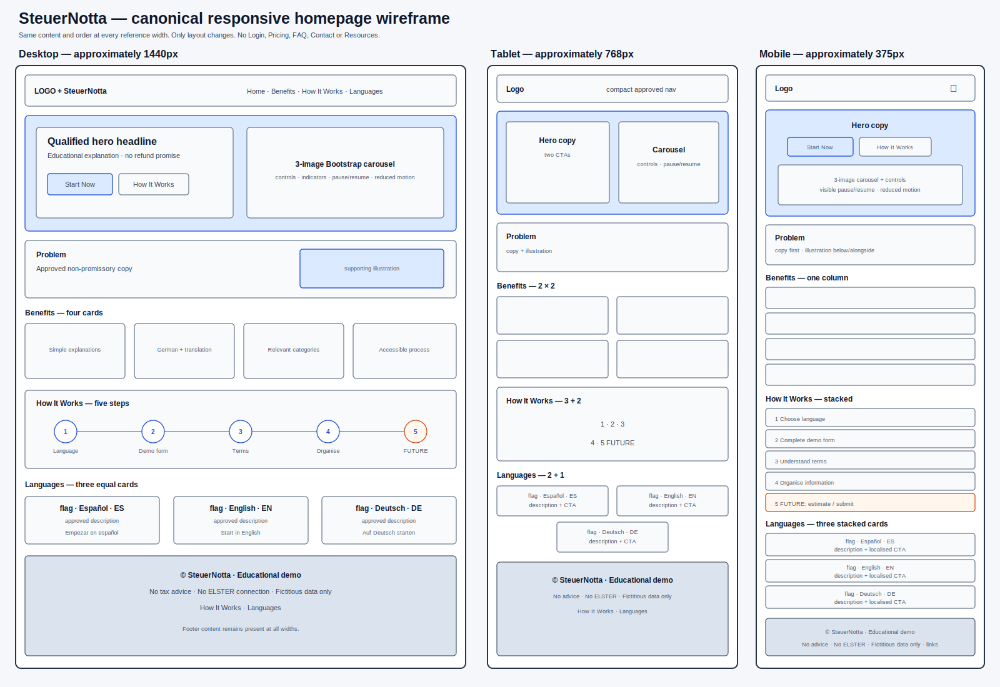
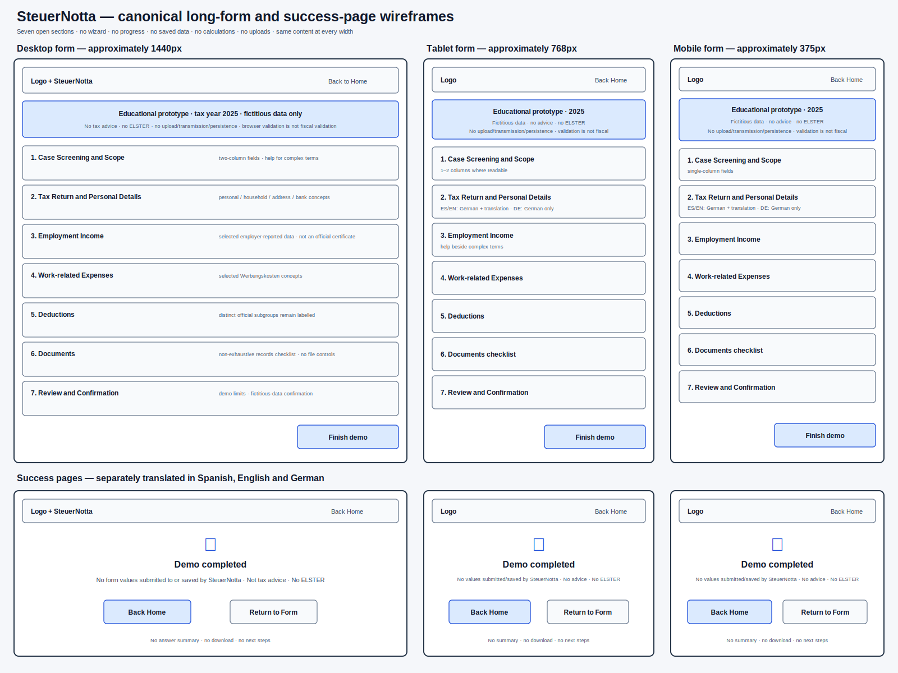

# SteuerNotta

> A multilingual educational frontend demo that helps salaried employees in Germany explore selected German tax terms and form concepts, with a primary focus on Spanish-speaking users.

[Repository](https://github.com/leonardodeutsch23/SteuerNotta) · **Live site:** not deployed yet · **Status:** planning · **Reference tax year:** 2025

## Important disclaimer

SteuerNotta is a web-development milestone project, not a tax product.

- It does **not** provide tax advice or replace a qualified `Steuerberater`.
- It is **not** connected to ELSTER, a German tax authority or a submission service.
- It does **not** calculate a refund, determine eligibility or submit a return.
- It does **not** upload, transmit or persist form data. The browser handles fictitious entries locally only for display and basic format/presence validation.
- The forms are for fictitious test data only.
- The fiscal wording and field inventory are provisional until they receive a documented field-by-field professional review.

The interface must never describe the demo as complete, certified, secure, encrypted or suitable for real personal or fiscal data.

## Table of contents

- [Project overview](#project-overview)
- [Goals and users](#goals-and-users)
- [Milestone scope](#milestone-scope)
- [User experience](#user-experience)
- [Page specifications](#page-specifications)
- [Form architecture](#form-architecture)
- [Responsive design](#responsive-design)
- [Design direction](#design-direction)
- [Accessibility](#accessibility)
- [User stories](#user-stories)
- [Planned technology stack](#planned-technology-stack)
- [Planned repository structure](#planned-repository-structure)
- [Project management](#project-management)
- [Testing](#testing)
- [Deployment](#deployment)
- [Content governance and sources](#content-governance-and-sources)
- [Future development](#future-development)
- [Credits](#credits)
- [License](#license)

## Project overview

German tax terminology can be difficult even for native speakers. For an employee who is not confident in German, official terms, tax-relevant categories and record-keeping requirements can make an income-tax return feel inaccessible.

SteuerNotta explores a clearer learning experience. It keeps the original German term visible, places a Spanish or English explanation directly beneath it and provides contextual help for difficult concepts.

The current repository will contain a frontend-only demonstration with:

- one English homepage;
- one long-form demo in Spanish, one in English and one in German;
- one matching success page for each form;
- consistent mobile, tablet and desktop layouts;
- clear limits and fictitious-data notices throughout.

The broader product vision may eventually include real guidance, calculations, accounts and submission. Those capabilities are future ideas and are not part of this milestone.

## Goals and users

### Primary user

An individual resident in Germany who receives German wage-taxed employment income and wants to explore selected concepts from the 2025 return, especially a Spanish-speaking employee who is not confident with German fiscal terminology. “Basic employee case” is project shorthand, not an official legal or ELSTER category.

### Secondary users

- English-speaking salaried employees in Germany.
- German-speaking employees who prefer a clearer educational structure.
- Course assessors and future content reviewers.

### User goals

- Understand common German tax terms in a familiar language.
- Recognise selected categories of information, expenses and records that may be relevant.
- Complete a structured demonstration without feeling overwhelmed.
- Learn what SteuerNotta can and cannot do.

### Project-owner goals

- Meet the frontend milestone requirements with a coherent HTML/CSS/Bootstrap project.
- Demonstrate UX planning, responsive design, accessibility, testing, Git and GitHub practice.
- Build a credible portfolio project around a real user problem.
- Establish a documented foundation for a possible future product without implying professional validation or affiliation.

## Milestone scope

### Included

- Static, responsive frontend hosted with GitHub Pages.
- English homepage with a Bootstrap navbar and three-image hero carousel.
- Problem, Benefits, How It Works and Languages sections.
- Spanish, English and German single-page forms with the same seven-section structure.
- German-first bilingual labels in the Spanish and English forms; German-only labels in the German form.
- Bootstrap help modals for difficult terms.
- Native HTML validation.
- Minimal custom JavaScript for closing the mobile navbar and completing the demo without sending form values.
- Three language-specific success pages.
- Local, credited and optimised visual assets.
- Planned testing documented without claiming unperformed results.

### Explicitly excluded

- Accounts, login, saved progress or `Save & exit`.
- Backend, database, analytics of form values or real data handling.
- Real document upload or file processing.
- Tax calculations, refund estimates or eligibility decisions.
- Conditional tax logic or automatic professional review.
- Review/download of a completed return.
- ELSTER or tax-authority integration.
- Pricing, payments, advisor booking or commercial checkout.
- FAQ, Resources, Contact, Privacy, Terms or Imprint pages for this milestone.
- A multi-step wizard, dynamic progress percentage or one-question-per-screen flow.

This is an academic scope decision, not a legal conclusion about which notices a future public or commercial service may require.

## User experience

The project follows the five-plane UX model.

| Plane | Canonical decision |
|---|---|
| Strategy | Explain German tax concepts to salaried employees, with Spanish as the primary accessibility need. |
| Scope | Educational frontend demo only; no fiscal processing or data handling. |
| Structure | Homepage → selected language form → matching language success page. |
| Skeleton | Same content at all breakpoints; only the layout changes. Forms stay as seven open sections on one long page. |
| Surface | Independent blue-led identity, clear cards, minimal linear icons and provisional Manrope/Inter typography. |

### Site map

```text
index.html
├── form-es.html ──→ success-es.html
├── form-en.html ──→ success-en.html
└── form-de.html ──→ success-de.html
```

Changing language inside a form is intentionally unavailable because navigating away would discard the current entries in this frontend-only version.

### Wireframes





These two low-fidelity SVGs are the canonical structural reference. Earlier generated mockups remain visual exploration only because several of them show out-of-scope features.

## Page specifications

All features below are planned; none should be marked implemented until code and tests exist.

### Homepage: `index.html`

The page order is fixed:

1. Navbar
2. Hero
3. Problem
4. Benefits
5. How It Works
6. Languages
7. Footer

#### Navbar

- SteuerNotta logo/wordmark.
- `Home`, `Benefits`, `How It Works` and `Languages` anchors, matching the page order.
- Bootstrap collapse on smaller screens.
- No Login, Pricing, FAQ, Contact or Resources links.

#### Hero

Audited provisional headline:

> Understand your German taxes — and explore what may affect a possible refund.

Audited provisional supporting copy:

> SteuerNotta helps salaried employees explore selected German tax concepts, keep the original German terminology visible, and organise fictitious information through a clear multilingual educational form.

This deliberately replaces the previously approved phrase “identify potential deductions”, which could be read as professionally validated guidance. It must not promise a refund or a valid return.

Calls to action:

- `Start Now` → `#languages`
- `How It Works` → `#how-it-works`

The buttons share a row while they fit and wrap only on narrower screens.

The hero includes a three-image Bootstrap carousel showing:

1. wage-tax records, receipts and selected tax-relevant categories;
2. salaried residents in Germany with German wage-taxed employment, especially Spanish-speaking users;
3. multilingual guidance in German, Spanish and English.

Final carousel behaviour approved in the project interview: autoplay, previous/next controls, indicators and Bootstrap's JavaScript bundle. To reconcile autoplay with accessibility, the implementation also requires a visible pause/resume control, pause on focus/hover and a non-autoplay experience when reduced motion is requested.

#### Problem

Approved heading:

> German taxes can be difficult — especially in another language.

Audited provisional supporting copy:

> German tax forms and official terminology can be difficult to understand, especially in another language. Uncertainty about which information may be relevant and fear of making mistakes can make the process feel intimidating.

This deliberately removes the unvalidated claims that users “can claim” particular items or that their case “may be relatively simple”. A secondary illustration may support the message without introducing additional features.

#### Benefits

1. **Simple explanations** — Clearer wording for complex concepts.
2. **German terms with translations** — Original terminology remains visible.
3. **Potentially relevant categories made visible** — Selected categories are presented as possibilities, not entitlements.
4. **A clearer, more accessible process** — Information is organised without false promises.

#### How It Works

1. **Choose your language.**
2. **Complete the guided demo form.**
3. **Understand the terminology.**
4. **Organise your tax information.**
5. **Future only: estimate and submit.**

Step five must be visually marked `Future feature` and must never look available in the milestone.

#### Languages

The three cards have equal visual importance and remain present at every breakpoint. Each complete card retains its local flag, language name, code, approved description and localised CTA even when the layout changes.

| Card | Flag | Code | Approved description | CTA | Destination |
|---|---|---|---|---|---|
| Español | Spain | ES | Complete the form in Spanish while seeing the original German tax terms. | `Empezar en español` | `form-es.html` |
| English | United Kingdom | EN | Complete the form in English while keeping the original German terminology visible. | `Start in English` | `form-en.html` |
| Deutsch | Germany | DE | Complete the form entirely in German. | `Auf Deutsch starten` | `form-de.html` |

Flags must be stored locally and credited with their source and licence.

#### Footer

- `© SteuerNotta`.
- Educational-demo notice.
- No-tax-advice notice.
- No-ELSTER-connection notice.
- Internal links to How It Works and Languages.

### Forms

- `form-es.html`
- `form-en.html`
- `form-de.html`

The three forms have complete structural parity. They are long, normally scrolling pages—not accordions, dynamic wizards or saved sessions.

The Spanish and English versions show the German term first and the translation immediately below it. The German version contains the same structure without redundant translations.

Complex fields use labelled Bootstrap modal buttons. Each help entry should explain the term, expected information, relevance, a plain example where appropriate and when professional help is advisable.

No file input is allowed. The Documents section is a preparation checklist only.

Browser validation checks only whether selected values are present or match a chosen format. It does not verify tax eligibility, legal accuracy, fiscal completeness or entitlement to a refund.

#### Demo completion behaviour

The forms must not use `method="get"` with real-looking field names because that would place the entered values in the URL and browser history. A small documented script should:

1. listen for a valid submit event;
2. call `preventDefault()`;
3. navigate to the matching success page without serialising form values.

This is convenience logic for fictitious demo data, not a security control. Each form's visible disclaimer and the homepage footer must still instruct testers to use invented values only.

### Success pages

- `success-es.html`
- `success-en.html`
- `success-de.html`

Each page contains, in its own language:

- confirmation that the demonstration ended;
- confirmation that no form values were submitted to or saved by SteuerNotta;
- no-tax-advice notice;
- no-ELSTER-connection notice;
- return-to-home button;
- return-to-matching-form button.

There is no answer summary, download or next-steps section.

## Form architecture

All three forms use exactly seven main sections:

1. **Case Screening and Scope** — A SteuerNotta UX grouping with reference year and residence/employment prompts that flag situations outside the prototype. It does not decide whether filing is compulsory or whether a case is legally “simple”.

2. **Tax Return and Personal Details** — Selected declaration, personal, household, address, partner and bank-information concepts informed by the `Hauptvordruck ESt 1 A`.

3. **Employment Income** — Selected educational fields informed by the 2025 `Lohnsteuerbescheinigung` and `Anlage N`. The certificate is issued and transmitted by the employer; this prototype is neither that certificate nor an official `Anlage N`.

4. **Work-related Expenses** — Provisional `Werbungskosten` concepts such as `Entfernungspauschale`, `Arbeitsmittel`, `Fortbildungskosten`, home-office categories and work-related travel. Similar-looking travel and home-office concepts must remain clearly distinguished.

5. **Deductions** — A presentation grouping—not one official deduction type. Any implemented subsections must distinguish insurance/pension items, `Sonderausgaben`, children, household-service tax reductions and extraordinary burdens.

6. **Documents** — A non-exhaustive checklist of records that may help a user review selected information. Records are generally retained and supplied only when official instructions require them or the Finanzamt requests them. SteuerNotta neither uploads evidence nor decides whether it is legally sufficient.

7. **Review and Confirmation** — A SteuerNotta UX grouping with fictitious-data confirmation, demo limits and navigation to the matching success page. It is not a fiscal review or validation.

This is an information architecture, not a claim that the fiscal field set is complete. Every proposed field and help text must be tracked in the [fiscal review matrix](docs/content/fiscal-review-matrix.md) before it is treated as approved content.

## Responsive design

Target review widths:

- mobile: approximately `375px`;
- tablet: approximately `768px`;
- desktop: approximately `1440px`.

Rules:

- mobile-first CSS;
- identical information and hierarchy at every breakpoint;
- layouts stack before content becomes compressed;
- related fields may use two columns when readable;
- long forms prioritise labels and help over density;
- touch targets remain usable;
- no horizontal scrolling at target widths.

Key layout changes:

| Area | Mobile | Tablet | Desktop |
|---|---|---|---|
| Hero | Stacked | Two columns when comfortable | Text left, carousel right |
| Benefits | 1 column | 2 × 2 | 4 columns |
| How It Works | Stacked | 3 + 2 | 5-step row |
| Languages | 1 column | Responsive grid with the third card centred/full row | 3 equal columns |
| Form fields | 1 column | 1–2 columns | 2 columns where related |

## Design direction

The visual system is provisional until it is tested in code.

- Independent identity with no visual relationship to NottaSports.
- Direction: symbol plus `SteuerNotta` wordmark, based on an `SN` translation/conversation concept.
- No commercial tagline inside the logo.
- Headings: **Manrope**.
- Body, labels and controls: **Inter**.
- Blue-led palette with explicit roles for primary, focus, information and status colours.
- Alternating blue/white sections, soft borders, restrained shadows and rounded cards.
- Linear, minimal icons with a consistent visual weight.
- Professional, approachable illustrations; not childish or falsely official.

```css
:root {
  --color-primary-dark: #123b66;
  --color-primary: #1f6fb2;
  --color-primary-light: #dceeff;
  --color-accent: #2f88d6;
  --color-background: #f7f9fc;
  --color-surface: #ffffff;
  --color-text: #1f2933;
  --color-text-muted: #5f6b76;
  --color-border: #cbd5e1;
  --color-success: #2e7d32;
  --color-warning: #b26a00;
  --color-error: #b3261e;
}
```

## Accessibility

Must Have requirements:

- semantic landmarks and a logical heading hierarchy;
- visible keyboard focus;
- associated `label`, `for` and unique `id` values;
- native links, buttons and controls;
- sufficient colour contrast;
- meaningful alternative text for informative images;
- empty alternative text for decorative images;
- accessible names/descriptions for Bootstrap modals;
- useful native validation constraints and guidance;
- correct `lang` on each page and `lang="de"` on German terms inside translated pages.

A full formal keyboard audit was not selected as a milestone deliverable, but the primary journey must remain keyboard-operable and will be checked manually.

## User stories

| Priority | User story | Acceptance criteria |
|---|---|---|
| Must Have | As a resident employee with German wage-taxed income, I want to understand the demo's purpose and limits so that I can decide whether it is relevant. | The homepage states the audience, value and limitations without implying tax advice or covering cross-border cases. |
| Must Have | As a user, I want to choose Spanish, English or German before starting. | Three equal cards link to the correct form. |
| Must Have | As a Spanish-speaking user, I want German terms with Spanish explanations. | German appears first and Spanish immediately below throughout `form-es.html`. |
| Must Have | As an English-speaking user, I want German terms with English explanations. | German appears first and English immediately below throughout `form-en.html`. |
| Must Have | As a German-speaking user, I want the same form in natural German. | `form-de.html` has the same seven sections and control intent without extra translations. |
| Must Have | As a user, I want difficult terms explained. | Labelled help controls open accessible Bootstrap modals. |
| Must Have | As a user, I want clear input requirements. | Appropriate native HTML constraints and guidance identify invalid or missing values. |
| Must Have | As a mobile user, I want the same information as a desktop user. | The journey is usable at 375px, 768px and 1440px without lost content or horizontal scrolling. |
| Must Have | As a cautious tester, I want to know what happens to my entries. | The UI says fictitious data only; the submit handler does not serialise or send values. |
| Must Have | As a user who finishes the demo, I want confirmation in the same language. | Each form opens its matching success page with the agreed notices and links. |
| Should Have | As a user, I want a trustworthy, approachable visual system. | The provisional type, colour, icon and card rules are applied consistently and pass contrast review. |
| Must Have | As a user, I want supportive hero imagery. | The carousel has three coherent local illustrations and usable controls. |
| Could Have | As a user, I want additional scan aids in the long form. | Static section anchors are added only if they remain consistent and accessible. |

## Planned technology stack

- HTML5
- CSS3
- Bootstrap 5 CSS and JavaScript bundle
- Minimal custom JavaScript for mobile-navbar closing and non-serialising demo completion
- Bootstrap Icons or Font Awesome, after one library is selected
- Manrope and Inter, subject to final delivery/hosting decision
- Git and GitHub
- GitHub Projects and GitHub Pages
- W3C validators, Lighthouse and browser developer tools

Do not list a technology as used until it exists in the repository.

## Planned repository structure

```text
SteuerNotta/
├── index.html
├── form-es.html
├── form-en.html
├── form-de.html
├── success-es.html
├── success-en.html
├── success-de.html
├── README.md
├── assets/
│   ├── css/style.css
│   ├── js/script.js
│   ├── images/
│   │   ├── logo/
│   │   ├── flags/
│   │   └── illustrations/
│   └── docs/wireframes/
└── docs/
    ├── audit/consistency-audit.md
    ├── content/fiscal-review-matrix.md
    ├── planning/github-plan.md
    └── testing/
```

Superseded drafts such as `form.html` and `form2.html` must not be committed as product pages. Useful research from them should be transferred into reviewed documentation first.

## Project management

- **GitHub Project:** `SteuerNotta Milestone Project`
- **Statuses:** `Todo`, `In Progress`, `Done`
- **Planning checkpoint:** 18 July 2026 (not a delivery milestone)
- **Single milestone:** `SteuerNotta Milestone Project`
- **Due date:** 31 July 2026
- **Working language:** English for README, issues, acceptance criteria and testing records
- **Git strategy:** small, focused commits directly on `main`
- **Deployment strategy:** deploy the first valid skeleton early, then verify continuously

Priority labels:

- `Must Have`
- `Should Have`
- `Could Have`

Type labels:

- `feature`
- `documentation`
- `design`
- `testing`
- `bug`
- `accessibility`
- `content`
- `translation`

The canonical issue list, checklists and acceptance criteria live in [docs/planning/github-plan.md](docs/planning/github-plan.md). An issue moves to `Done` only when its acceptance criteria are met and the relevant evidence is recorded.

## Testing

No test result is claimed yet.

| Test | Purpose | Status |
|---|---|---|
| W3C HTML Validator | HTML validity and semantic errors | Planned |
| W3C CSS Validator | CSS validity | Planned |
| Lighthouse | Accessibility, performance, best practices and SEO | Planned |
| Manual links | Navigation, CTAs, language routes and footer | Planned |
| Forms | Required fields, formats, help modals and non-serialising completion | Planned |
| Responsive review | 375px, 768px and 1440px layouts | Planned |
| Cross-browser review | Chrome, Firefox, Edge and Safari | Planned |
| Keyboard smoke test | Primary journey, focus order and visible focus | Planned |

Use this evidence format:

```text
Expected result → Test performed → Actual result → Fix or conclusion
```

The autoplay carousel is a known accessibility risk. Timing, controls, focus, pause behaviour and reduced-motion behaviour require explicit review.

## Deployment

Expected URL after GitHub Pages is enabled:

```text
https://leonardodeutsch23.github.io/SteuerNotta/
```

Early-deployment sequence:

1. Add a valid `index.html` and base asset paths.
2. Commit and push the smallest working skeleton to `main`.
3. Enable GitHub Pages from `main` and `/ (root)`.
4. Verify the public URL and case-sensitive paths.
5. Add the confirmed live URL at the top of this README.
6. Re-test the deployed build after every material change.

## Content governance and sources

### Fiscal-content rule

Official references support research; they do not certify this project. No field is considered professionally approved until the fiscal review matrix records reviewer, date, reference year, source and decision.

Initial official references:

- [ELSTER — Income-tax return forms, including ESt 1 A through 2025](https://www.elster.de/eportal/formulare-leistungen/alleformulare/est)
- [ELSTER — 2025 income-tax / Anlage N completion help](https://www.elster.de/elsterweb/helpGlobal?themaGlobal=help_est_ufa_10_2025)
- [BMF — Updated 2025 electronic wage-tax certificate template](https://www.bundesfinanzministerium.de/Content/DE/Downloads/BMF_Schreiben/Steuerarten/Lohnsteuer/2025-02-20-geaen-ausdruck-elektron-LSt-besch-2025.html)
- [Lohnsteuer-Handbuch 2025 — Lohnsteuerbescheinigung](https://ao.bundesfinanzministerium.de/lsth/2025/B-Anhaenge/Anhang-23/uebersicht.html)
- [BMF — 2026 wage-tax certificate template, used only to document that later years differ](https://www.bundesfinanzministerium.de/Content/DE/Downloads/BMF_Schreiben/Steuerarten/Lohnsteuer/2025-08-29-ausdruck-elektr-lstbesch-2026.html)

**Fiscal reference year: 2025. Official sources reviewed on 15 July 2026. SteuerNotta does not represent tax year 2026 or later.** Forms and rules change by year; later years require a new review rather than a silent reuse of the same fields. ELSTER's English interface uses machine translation and excludes forms and completion help from that translation, so it is not evidence that SteuerNotta's Spanish or English fiscal wording is correct.

Framework references:

- [Bootstrap 5.3 — Navbar](https://getbootstrap.com/docs/5.3/components/navbar/)
- [Bootstrap 5.3 — Carousel](https://getbootstrap.com/docs/5.3/components/carousel/)
- [Bootstrap 5.3 — Forms](https://getbootstrap.com/docs/5.3/forms/overview/)
- [Bootstrap 5.3 — Modal](https://getbootstrap.com/docs/5.3/components/modal/)

## Future development

- One-question-per-screen guided flow.
- Conditional questions and real progress tracking.
- Secure accounts, saving and resuming.
- Secure document handling.
- Professionally reviewed tax logic and refund estimates.
- Generated summaries.
- ELSTER integration where legally and technically appropriate.
- Additional languages.
- Support for self-employed people, businesses and complex cases.
- Possible professional-advisor escalation, subject to a later product decision.
- Dedicated privacy, imprint, terms and legal pages.

None of these features may appear active in the milestone interface.

## Credits

- The responsive-navbar closing script will be adapted from the earlier Boardwalk Games course project; the exact source and changes must be documented when the code is added.
- Flags, icons, fonts and illustrations must be credited with source, licence and modifications before release.
- Generated assets must record the tool and relevant editing history.
- The wireframes in `assets/docs/wireframes/` were created specifically for the audited SteuerNotta milestone scope.
- No formal partnership with a tax firm is claimed.

## License

No licence has been selected. The repository may be publicly visible, but no general permission to copy, modify or redistribute the code is granted unless a licence is added later.

## Author

Created by [Leonardo Deutsch](https://github.com/leonardodeutsch23) for the **Web Application Development with AI** course.
