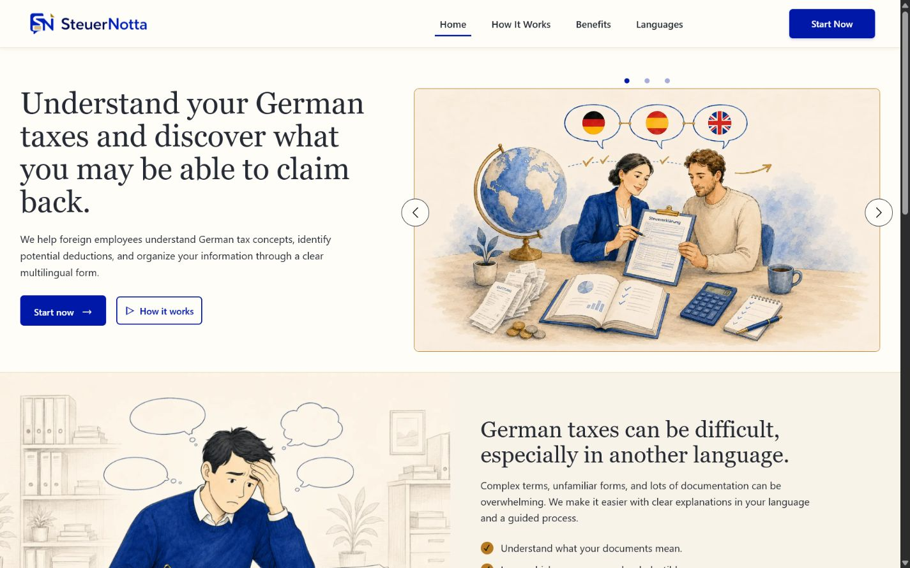
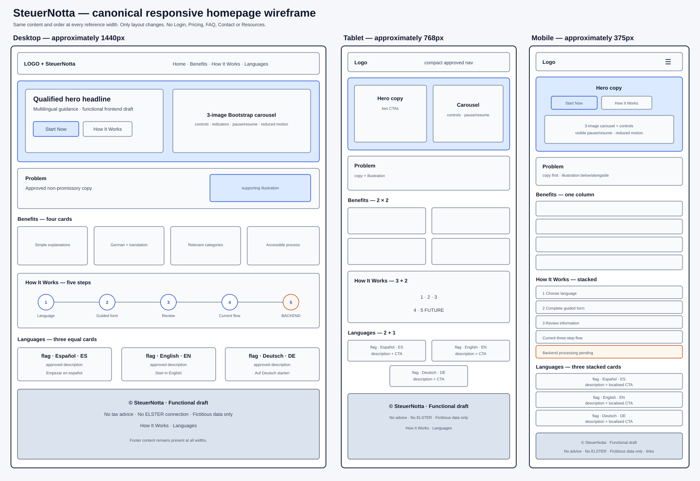
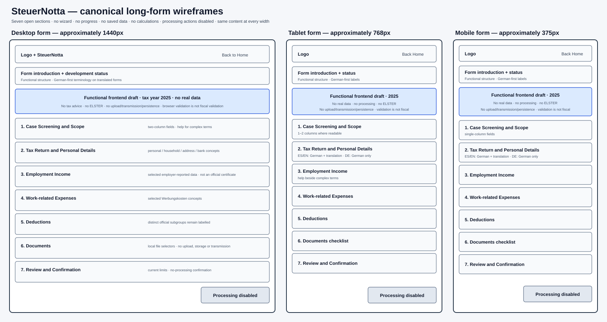
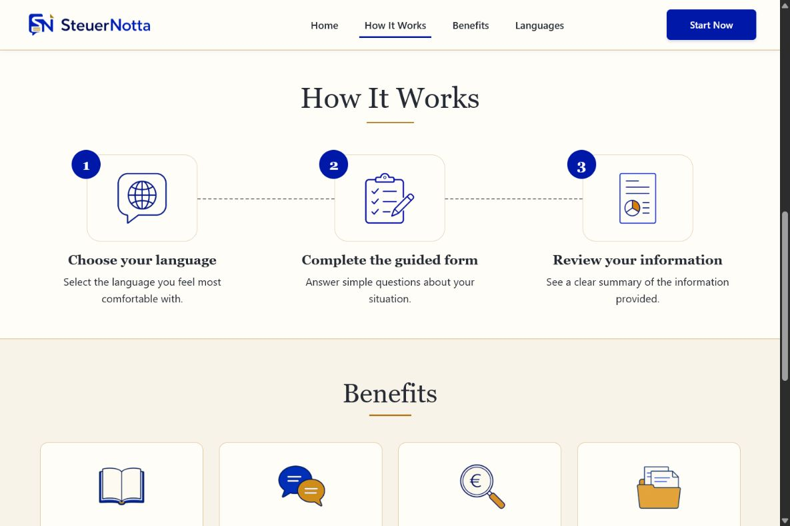
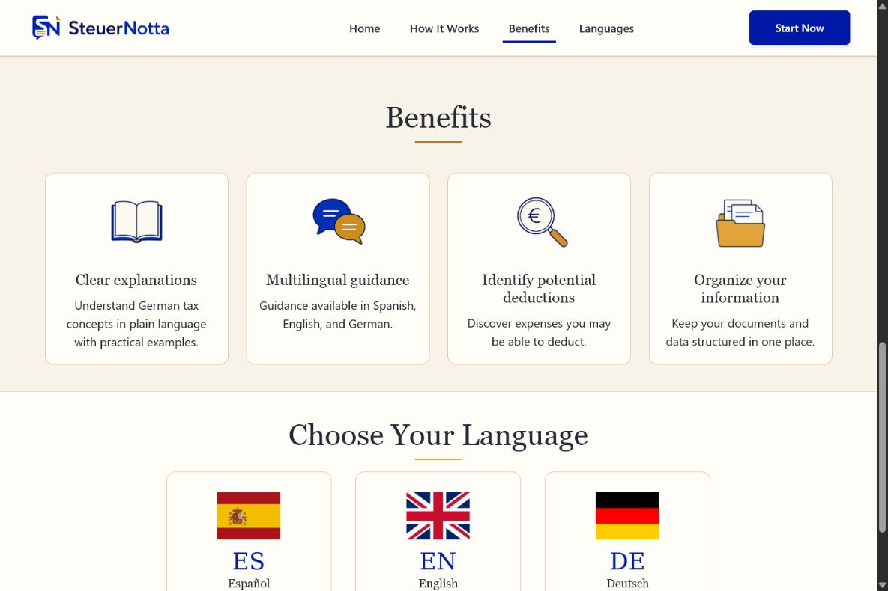
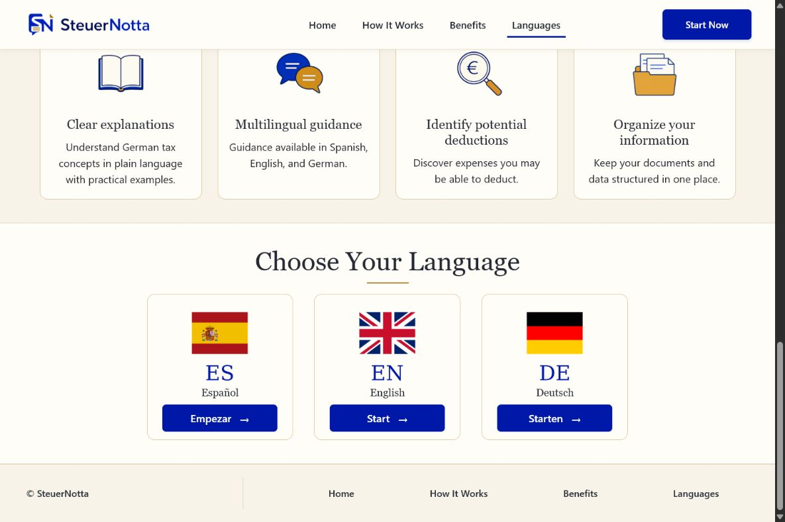
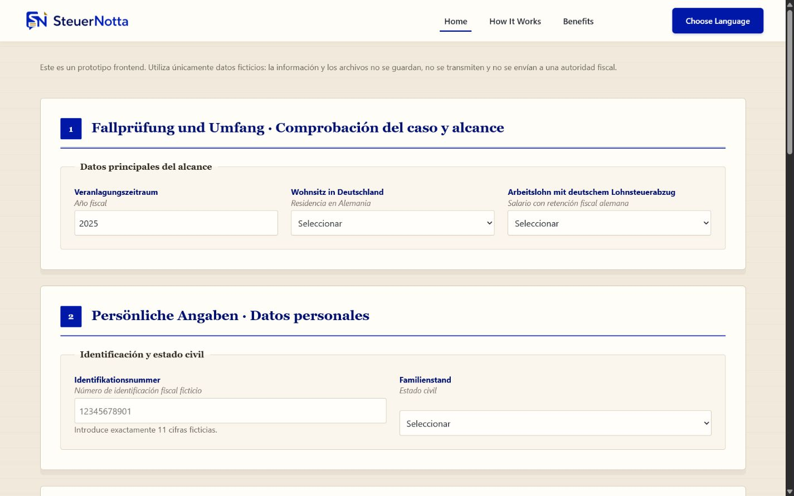

# SteuerNotta

SteuerNotta is a responsive multilingual frontend MVP that helps foreign employees organise
basic information before approaching a German income-tax return. It introduces selected German tax
terms in Spanish, English and German through a clear landing page and three matching form routes.

The current milestone demonstrates information architecture, responsive design, accessibility and
HTML form constraints. It does not calculate tax, save information, upload files or submit data to
ELSTER or another service.

[View the deployed site](https://leonardodeutsch23.github.io/SteuerNotta/) ·
[View the repository](https://github.com/leonardodeutsch23/SteuerNotta) ·
[Read the complete testing record](TESTING.md)



## Table of contents

1. [Project goals](#project-goals)
2. [User experience](#user-experience)
3. [Design](#design)
4. [Features](#features)
5. [Form scope](#form-scope)
6. [Technologies](#technologies)
7. [Testing](#testing)
8. [Bugs and limitations](#bugs-and-limitations)
9. [Deployment](#deployment)
10. [Project management](#project-management)
11. [Future development](#future-development)
12. [Credits and licences](#credits-and-licences)

## Project goals

### Purpose

German tax information can be difficult to approach when the user is unfamiliar with the language
and document structure. SteuerNotta aims to:

- explain a small set of German terms in plain language;
- show users what basic information could be organised before a future guided process;
- offer equivalent Spanish/German, English/German and German-only routes;
- provide a consistent experience on mobile, tablet and desktop;
- make the current technical limitations visible before a user reaches the form.

### Target users

The primary audience is foreign employees living or working in Germany who want a simple
introduction before using official services or seeking professional support. The current MVP is not a
replacement for ELSTER, tax software or professional tax advice.

### Current scope

| Included in this milestone | Not included in this milestone |
|---|---|
| Responsive one-page introduction | Tax calculations or refund estimates |
| Spanish, English and German form routes | Account creation or saved progress |
| Seven clearly labelled form sections | Conditional JavaScript behaviour |
| Twelve matching controls per route | Data storage, transmission or file upload |
| Native HTML constraints and accessible labels | Submission, success or completion pages |
| GitHub Pages deployment and documented QA | Connection to ELSTER or a tax authority |

Only fictitious data should be used. The forms deliberately keep reset and review actions disabled
until local processing behaviour can be implemented and tested.

## User experience

### Strategy

The project prioritises clarity, trust and language choice over collecting a large amount of tax
information. The main call to action takes the visitor to the language cards. From there, each
internal link opens its form in the same browser tab so that normal Back-button behaviour is
preserved.

### User stories

| Priority | As a user, I want to… | Implemented outcome |
|---|---|---|
| Must Have | understand the purpose of the site immediately | The hero explains the project and its main benefit. |
| Must Have | navigate the page on any screen size | A fixed responsive navbar, skip link and footer provide internal navigation. |
| Must Have | understand the proposed process | How It Works presents the three-step journey. |
| Must Have | see the intended benefits before choosing a form | Four responsive Benefits cards describe the intended value of the product. |
| Must Have | choose Spanish, English or German | Three equally prominent language cards open matching local routes. |
| Must Have | explore the same form structure in each language | All three routes contain the same seven sections and twelve controls. |
| Must Have | know what happens to my information | Every form warns that data is not saved or transmitted and keeps processing actions disabled. |
| Must Have | use the site with keyboard or assistive technology | Semantic landmarks, associated labels, focus states and accessible names are implemented. |
| Should Have | review a completed summary locally | Deferred until JavaScript processing is introduced. |

Detailed tests against these stories are recorded in [TESTING.md](TESTING.md#user-story-testing).

### Structure and user flow

1. The visitor arrives on the homepage and reads the introduction.
2. The visitor reviews the problem, process and benefits.
3. The visitor chooses a language.
4. The selected form opens in the same tab.
5. The visitor can explore a short seven-section draft using fictitious data.
6. The final section explains that review, reset and submission behaviour is not connected.

## Design

### Visual direction

The “Nordic Ledger” direction combines a warm paper-like background with cobalt rules and restrained
amber details. The visual language is intended to resemble an organised dossier rather than a
clinical application.

| Role | Colour | Use |
|---|---|---|
| Primary | `#0018a8` | Buttons, active navigation, section numbers and important labels |
| Accent | `#b7791f` | Dividers, checks and decorative highlights |
| Background | `#f8f3e8` | Warm ivory page areas |
| Surface | `#fffdf8` | Cards, forms and navigation |
| Text | `#252a34` | Primary body copy |

Headings use Georgia with Times New Roman as a fallback. Body text uses a system sans-serif stack so
that the site does not depend on an external font request.

### Wireframes

The responsive wireframes were prepared for mobile, tablet and desktop before the final CSS
refinements.

#### Homepage



#### Form



The original form concept was later simplified after mentor feedback. The final milestone retains
the seven-section journey but reduces the field set to twelve representative controls so that every
control can be tested and documented.

## Features

### Navigation and hero

The fixed Bootstrap navbar includes Home, How It Works, Benefits, Languages and Start Now. It
collapses behind a labelled menu button below the desktop breakpoint. Scroll offsets prevent section
headings from being hidden behind the fixed bar.

The hero combines the main message, two calls to action and a three-image Bootstrap carousel with
named previous, next and indicator controls.

### Problem section

The responsive picture uses different local crops for mobile, tablet, laptop and desktop. Supporting
copy and four short benefits explain why the product exists.

### How It Works

The three steps reflow from cards in one mobile column to an illustrated horizontal sequence on
larger screens.



### Benefits

Four cards explain the intended benefits: clear explanations, multilingual guidance, potential
deduction awareness and organised information.



### Language selection

The Spanish, English and German cards are equal in visual importance. Their CTAs open
`form-es-de.html`, `form-en-de.html` and `form-de-de.html` in the current tab. Flag artwork is
credited in [THIRD-PARTY-NOTICE.txt](THIRD-PARTY-NOTICE.txt).



### Multilingual forms

The form routes share IDs, names, control types, option values and section order:

- `form-es-de.html` — German terms followed by Spanish explanations;
- `form-en-de.html` — German terms followed by English explanations;
- `form-de-de.html` — German-only presentation.



The layout is mobile-first. Fields stack on small screens, form two columns on tablets and use up to
three columns where the available width permits.

### Footer

The footer repeats the implemented homepage navigation and remains at the bottom of short pages
without covering long form content.

## Form scope

Every route contains the same twelve controls:

| Section | Controls | Constraint or behaviour |
|---|---|---|
| 1. Case review and scope | Reference year, residence, German payroll withholding | Year is read-only; both selects are required. |
| 2. Personal information | Fictitious tax ID, marital status | ID requires exactly 11 digits; status is required. |
| 3. Employment | Fictitious employer, gross wages | Employer is required with an 80-character limit; wages are required and cannot be negative. |
| 4. Work expenses | Total work expenses | Optional decimal value with a minimum of zero. |
| 5. Other expenses | Total special expenses | Optional decimal value with a minimum of zero. |
| 6. Documents | Local file selector | Optional PDF/JPG/PNG selection; multiple files may be displayed locally but are not uploaded. |
| 7. Review | Fictitious-data confirmation, notes | Confirmation is required; notes have a 500-character limit. |

The complete control-by-control test matrix is in
[TESTING.md](TESTING.md#form-control-testing).

## Responsive and accessibility behaviour

The project uses mobile-first styles and checks three primary reference widths:

- `375px` mobile;
- `768px` tablet;
- `1440px` desktop.

Implemented accessibility work includes:

- semantic `header`, `nav`, `main`, `section`, `form` and `footer` landmarks;
- skip links on every route;
- exactly one `h1` per page;
- associated labels and unique IDs;
- `lang` metadata for the page and German terms;
- visible keyboard focus;
- descriptive alternative text;
- accessible carousel controls and indicators;
- sufficient primary colour contrast;
- explicit help text for file selectors and disabled processing actions.

## Technologies

- HTML5 for semantic page and form structure.
- CSS3 with custom properties and media queries.
- [Bootstrap 5.3.8](https://getbootstrap.com/) for the responsive grid, navbar and carousel.
- A short inline script adapted from a Code Institute activity to close the mobile homepage navbar
  after selecting an internal destination.
- Git and GitHub for version control, issues and project management.
- GitHub Pages for deployment.
- W3C Nu HTML Checker and W3C CSS Validation Service for code validation.
- Lighthouse 13.0.1 for performance, accessibility, best-practices and SEO auditing.

## Testing

Testing is documented separately so that evidence is easy to inspect:

**[Open the complete TESTING.md](TESTING.md)**

Current headline results:

| Check | Result |
|---|---|
| HTML validation | 0 errors and 0 warnings on all four pages |
| CSS validation | 0 errors in both project stylesheets |
| Form parity | 7 sections and 12 matching controls on each route |
| Duplicate control IDs | 0 |
| Responsive overflow | None at 375px, 768px or 1440px |
| Lighthouse — Home mobile/desktop | 92 / 100 performance; 100 for all other categories |
| Lighthouse — ES form mobile/desktop | 97 / 100 performance; 100 for all other categories |
| Lighthouse — EN form mobile/desktop | 97 / 100 performance; 100 for all other categories |
| Lighthouse — DE form mobile/desktop | 96 / 100 performance; 100 for all other categories |
| Internal links opening new tabs | None |
| Connected form submission/reset actions | None |

## Bugs and limitations

### Fixed during development

| Problem | Resolution |
|---|---|
| GitHub Pages image paths failed because of local/deployed path differences | All image references now use case-correct project-relative paths. |
| Fixed navbar covered section headings | Section scroll margins were added and tested. |
| Mobile navigation stayed open after selecting a section | The collapsed menu is closed by the adapted inline script. |
| Form fields and unpaired cards were misaligned at tablet widths | Shared grid and centring rules were added. |
| The marital-status select sat below the paired tax-ID field | A scoped rule aligns both controls directly below their labels while preserving the helper note. |
| Carousel and Problem images cropped inconsistently | Purpose-specific responsive image sources were supplied. |
| Desktop navbar action could extend beyond the viewport | The responsive action gap was reduced and rechecked at 1440px. |
| Internal form links opened unnecessary new tabs | `target="_blank"` was removed from all three language cards. |
| The original 318-control draft was too large for meaningful assessment testing | The routes were reduced to 12 matching, documented controls. |

### Known limitations

- Form processing is intentionally unavailable.
- File inputs display only the browser's local file-selection interface.
- Native browser validation messages may differ slightly between browsers.
- The homepage mobile Lighthouse performance score is affected mainly by large local illustrations
  and render-blocking CSS.
- Fiscal wording and translations are development drafts and have not received professional
  approval.

## Deployment

The site is deployed through GitHub Pages from the root of the `main` branch.

### GitHub Pages

1. Open the repository on GitHub.
2. Select **Settings** and then **Pages**.
3. Under **Build and deployment**, choose **Deploy from a branch**.
4. Select `main` and `/ (root)`.
5. Save and wait for the published URL.

The deployed site is available at:
[https://leonardodeutsch23.github.io/SteuerNotta/](https://leonardodeutsch23.github.io/SteuerNotta/)

### Local use

1. Clone the repository:

   ```bash
   git clone https://github.com/leonardodeutsch23/SteuerNotta.git
   ```

2. Open the project directory.
3. Serve the root with a local static server, such as VS Code Live Server.
4. Open `index.html` through the local server.

No build command, environment variable, database or secret is required.

## Project management

- [GitHub Project board](https://github.com/users/leonardodeutsch23/projects/5)
- [Repository issues](https://github.com/leonardodeutsch23/SteuerNotta/issues)
- [Detailed planning record](docs/planning/github-plan.md)
- [Consistency audit](docs/audit/consistency-audit.md)

Issues #1–#12 document the original frontend milestone. Issue #13 records professional fiscal and
linguistic review as future production work. Issue #14 records the mentor-feedback changes that
prepared the repository for assessment.

## Future development

1. Add JavaScript-driven local validation feedback and conditional questions.
2. Generate a local review summary without transmitting data.
3. Connect reset and review actions only after the complete interaction is tested.
4. Decide whether the product remains local-only or later requires a secured backend.
5. Define privacy, consent, retention and document-handling requirements before real-data use.
6. Freeze the fiscal scope and obtain the professional review tracked in Issue #13.
7. Run a full accessibility and cross-browser regression after functional behaviour is introduced.

## Credits and licences

### Project responsibility

Project direction, design decisions and final implementation responsibility belong to Leonardo
Deutsch.

OpenAI Codex provided assistance with code review, project-file organisation, documentation,
quality-assurance planning and the Git/GitHub workflow. Leonardo Deutsch retained the final
decisions and responsibility for the delivered project.

### Code

- The navbar structure and responsive-navbar closing pattern were adapted from the Boardwalk Games
  activity completed as part of the Code Institute coursework.
- Bootstrap documentation informed the navbar, grid and carousel implementation.

### Media

- The logo, carousel scenes, Problem illustration, Benefit graphics, How It Works graphics and
  language-card compositions were created for SteuerNotta with generative-image assistance and
  exported as local project assets.
- Flag artwork used within the language cards comes from
  [flag-icons 7.5.0](https://github.com/lipis/flag-icons), Copyright (c) 2013 Panayiotis Lipiridis,
  under the MIT License. The full notice is included in
  [THIRD-PARTY-NOTICE.txt](THIRD-PARTY-NOTICE.txt).
- The responsive SVG wireframes were created specifically for SteuerNotta.

### Reference projects

The README and testing structure were reviewed against:

- [Code Institute README structure provided by the mentor](https://github.com/CIMarko/BC_project_1);
- [Rathnure RowFit reference README and TESTING record](https://github.com/Code-Institute-Submissions/rathnure-rowfit).

## Author

Leonardo Deutsch — [GitHub profile](https://github.com/leonardodeutsch23)
