# SteuerNotta Testing

This document records the tests completed for the current SteuerNotta milestone. The tested
implementation is a responsive static frontend with one homepage and three equivalent form routes.
The forms use native HTML constraints but do not save, upload or transmit data.

[Return to the README](README.md)

## Contents

1. [Test environments](#test-environments)
2. [User story testing](#user-story-testing)
3. [Navigation and link testing](#navigation-and-link-testing)
4. [Form control testing](#form-control-testing)
5. [Multilingual parity](#multilingual-parity)
6. [Responsive testing](#responsive-testing)
7. [Accessibility and keyboard testing](#accessibility-and-keyboard-testing)
8. [Browser compatibility](#browser-compatibility)
9. [Code validation](#code-validation)
10. [Lighthouse](#lighthouse)
11. [Bugs fixed during testing](#bugs-fixed-during-testing)
12. [Known limitations](#known-limitations)

## Test environments

| Environment | Purpose |
|---|---|
| Local Python static server on Windows 11 | Functional and visual checks before deployment |
| Google Chrome 150.0.7871.187 on Windows 11 | Responsive, navigation and form checks |
| Microsoft Edge 150.0.4078.105 on Windows 11 | Independent Chromium-browser layout check |
| GitHub Pages | Route, asset, W3C and Lighthouse verification of the published site |
| W3C Nu HTML Checker | HTML conformance |
| W3C CSS Validation Service | CSS conformance |
| Lighthouse 13.0.1 | Performance, accessibility, best-practices and SEO audits |

The primary responsive reference widths were `375px`, `768px` and `1440px`. The page was also
resized between those values to find breakpoint or overflow problems. The evidence in this document
was refreshed on 29 July 2026.

## User story testing

| User story | Test | Expected result | Result |
|---|---|---|---|
| Understand the purpose immediately | Open the homepage at the top | The hero explains the problem and provides clear calls to action | Pass |
| Navigate on any screen size | Use the navbar and footer at all reference widths | Links reach the correct sections; the mobile menu remains usable | Pass |
| Understand the proposed process | Open How It Works | Three ordered steps are visible and readable | Pass |
| See the intended benefits | Open Benefits | Four benefit cards are visible and adapt to the viewport | Pass |
| Choose a language | Select each language card | The corresponding internal form opens in the same tab | Pass |
| Receive the same form structure in every language | Compare all three form routes | Section order, control IDs, names, types and option values match | Pass |
| Know what happens to entered information | Read the final review section | The user is told that nothing is saved or transmitted | Pass |
| Use the site with a keyboard | Tab through navigation, carousel and form controls | Interactive elements receive visible focus in a logical order | Pass |
| Review or submit information | Inspect the final actions | Reset and review buttons remain disabled because processing is not implemented | Pass |

## Navigation and link testing

| Page or component | Action | Expected result | Result |
|---|---|---|---|
| Homepage logo/Home | Activate | Return to `#home` without hiding the hero heading behind the fixed navbar | Pass |
| How It Works link | Activate | Scroll to `#how-it-works` with the section heading visible | Pass |
| Benefits link | Activate | Scroll to `#benefits` with the section heading visible | Pass |
| Languages/Start Now | Activate | Scroll to `#languages` | Pass |
| Hero secondary action | Activate | Scroll to How It Works | Pass |
| Carousel controls | Activate previous/next and indicators | Active image changes and controls retain accessible names | Pass |
| Spanish language CTA | Activate | Open `form-es-de.html` in the same tab | Pass |
| English language CTA | Activate | Open `form-en-de.html` in the same tab | Pass |
| German language CTA | Activate | Open `form-de-de.html` in the same tab | Pass |
| Form navbar/footer links | Activate | Return to the requested homepage section in the same tab | Pass |
| Skip link | Focus and activate | Move focus to the main content | Pass |

No internal link uses `target="_blank"`. This preserves normal Back-button behaviour and avoids
opening unnecessary browser tabs.

## Form control testing

The following matrix was executed on `form-es-de.html` using fictitious values. Structural parity
checks confirmed that the same constraints are present on the English/German and German-only routes.

| Control | Empty or default case | Invalid case | Valid case | Result |
|---|---|---|---|---|
| Reference year | Contains `2025` | Editing is not permitted | Read-only value remains `2025` | Pass |
| Residence in Germany | Required placeholder is invalid | Not applicable | Select a valid Yes/No option | Pass |
| German payroll withholding | Required placeholder is invalid | Not applicable | Select a valid Yes/No option | Pass |
| Fictitious tax ID | Required empty value is invalid | `123` fails the 11-digit pattern | `12345678901` is valid | Pass |
| Marital status | Required placeholder is invalid | Not applicable | Select one listed status | Pass |
| Fictitious employer | Required empty value is invalid | More than 80 typed characters is prevented by `maxlength` | `Test Employer` is valid | Pass |
| Gross wages | Required empty value is invalid | `-1` is invalid | `1000.50` is valid | Pass |
| Work expenses | Empty optional value is valid | `-1` is invalid | `0` is valid | Pass |
| Special expenses | Empty optional value is valid | `-1` is invalid | `0.01` is valid | Pass |
| Documents | Empty optional value is valid | The `accept` attribute suggests the listed formats to the browser picker | Multiple PDF/JPG/JPEG/PNG files may be selected locally | Pass |
| Fictitious-data confirmation | Unchecked required box is invalid | Not applicable | Checked box is valid | Pass |
| Notes | Empty optional value is valid | Typed input is limited by `maxlength="500"` | Text within 500 characters is valid | Pass |

Additional checks:

- number controls use `min="0"` and `step="0.01"`;
- the file selector has `multiple` and `accept=".pdf,.jpg,.jpeg,.png"`;
- every visible control has an associated label;
- every ID is unique within its page;
- the form has no connected submission target;
- the Reset and Review buttons are visibly and programmatically disabled.

Native validation messages are intentionally browser-provided, so their exact wording can vary.
The following captures record representative states; the corresponding browser validity properties
were also inspected during the test:

| Evidence | Observed result |
|---|---|
| [Required selects left on their default option](docs/testing/evidence/forms/required-controls-empty.png) | Both controls reported `valueMissing: true` |
| [Three-digit tax ID](docs/testing/evidence/forms/tax-id-pattern-invalid.png) | `patternMismatch: true`; the 11-digit helper remains visible |
| [Negative gross-wage value](docs/testing/evidence/forms/negative-amount-invalid.png) | `rangeUnderflow: true` because `min="0"` |
| [Document selector](docs/testing/evidence/forms/file-input-accept.png) | `multiple` is enabled and `accept=".pdf,.jpg,.jpeg,.png"` is present |

## Multilingual parity

Automated structural comparison produced the following result:

| Route | Sections | Controls | Duplicate IDs | Structural signature |
|---|---:|---:|---:|---|
| `form-es-de.html` | 7 | 12 | 0 | Baseline |
| `form-en-de.html` | 7 | 12 | 0 | Matches baseline |
| `form-de-de.html` | 7 | 12 | 0 | Matches baseline |

The comparison included element tag, ID, `name`, input `type`, validation attributes and select
option values. Visible supporting copy changes by language, while the data structure remains equal.

## Responsive testing

### Homepage

| Width | Checks | Result |
|---:|---|---|
| 375px | Collapsed navigation, stacked hero, usable carousel, single-column feature cards and language cards | Pass |
| 768px | Collapsed tablet navigation, two-column content where appropriate and balanced card layout | Pass |
| 1440px | Expanded navigation, two-column hero/problem sections and complete card rows | Pass |

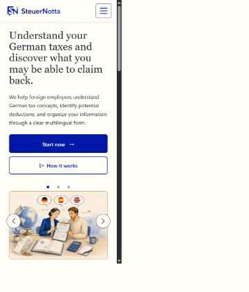

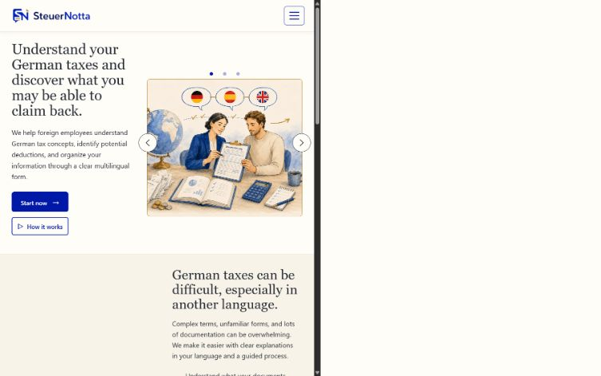

### Form

| Width | Checks | Result |
|---:|---|---|
| 375px | One-column fields, readable legends, no clipped controls and full-width footer | Pass |
| 768px | Two-column field layout, aligned controls and centred unpaired items | Pass |
| 1440px | Up to three columns, consistent spacing and footer spanning the viewport | Pass |

The three language routes were checked independently because translated labels can wrap at
different points:

| Route | 375px | 768px | 1440px |
|---|---|---|---|
| Spanish/German | Pass | Pass | Pass |
| English/German | Pass | Pass | Pass |
| German | Pass | Pass | Pass |

#### Spanish/German form

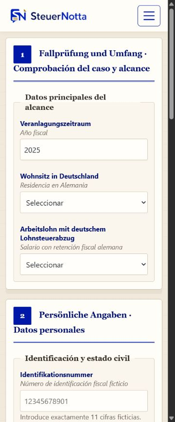

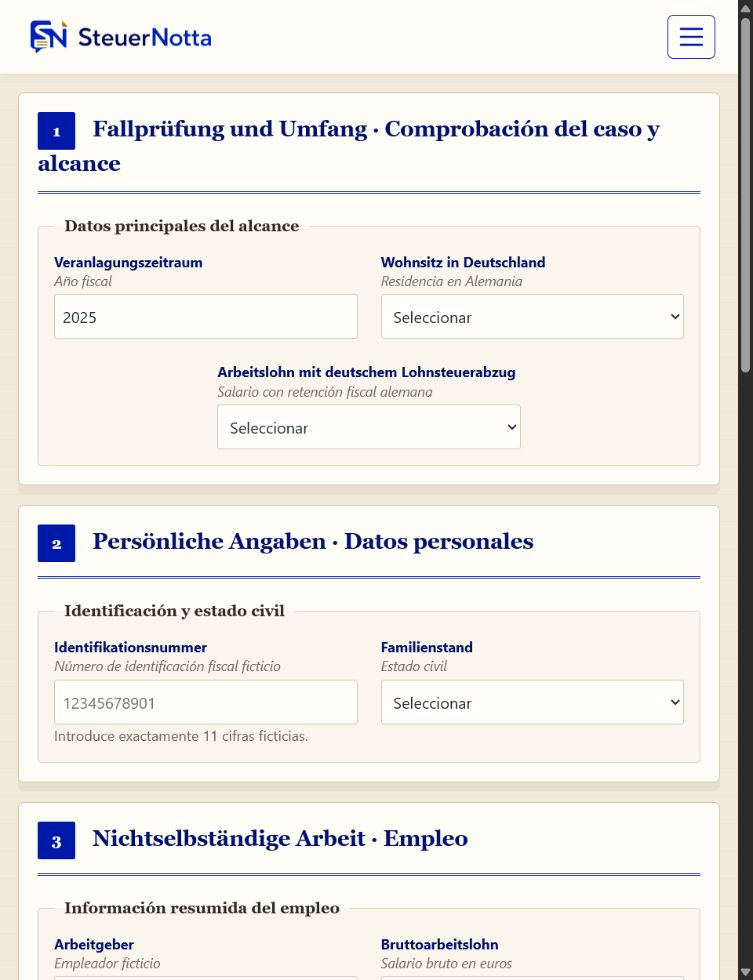

#### English/German form

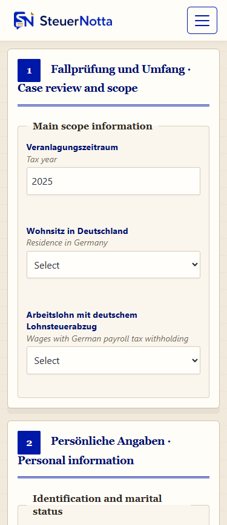

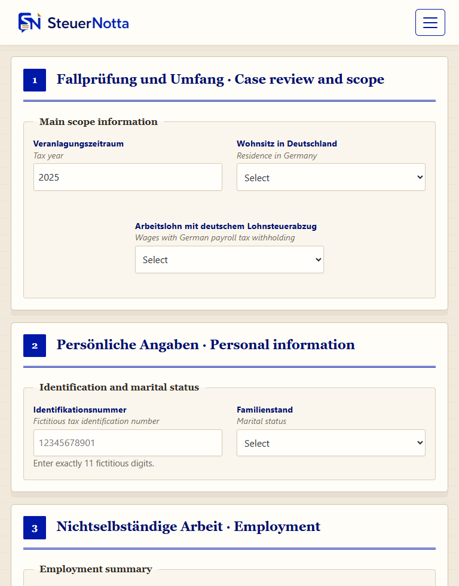

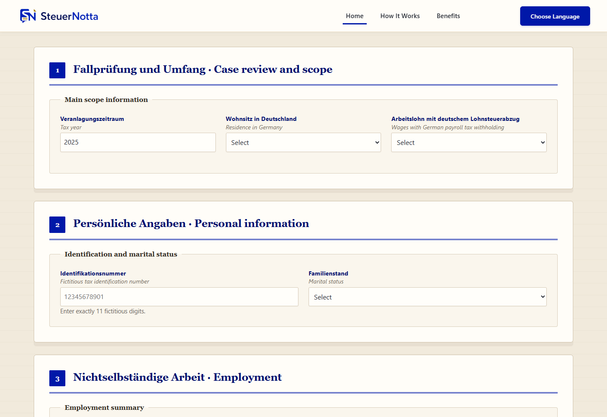

#### German form

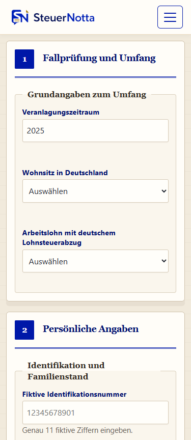

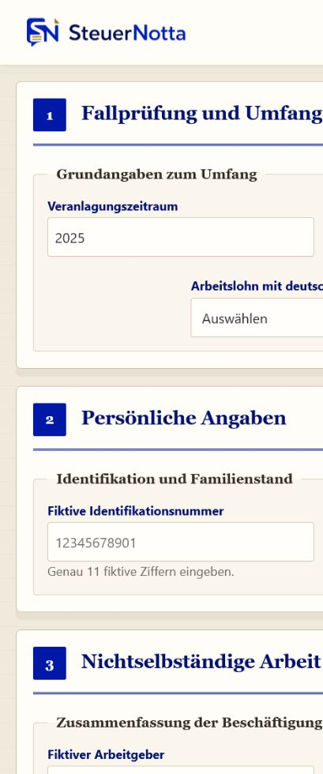

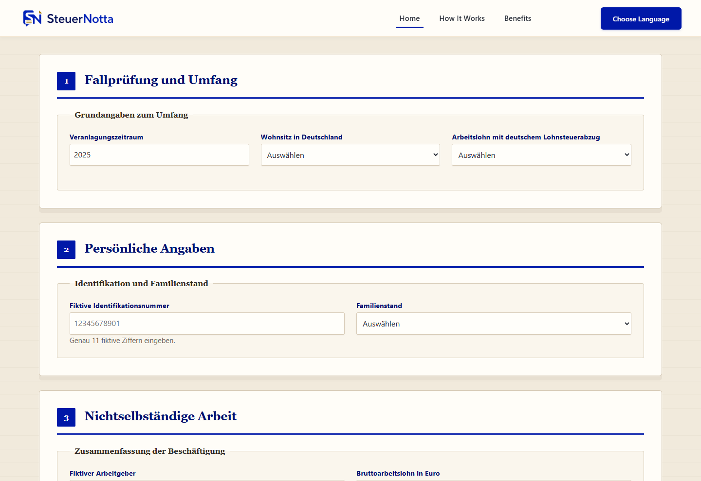

At all three widths, the measured document width did not exceed the viewport width. No horizontal
scrollbar was produced.

## Accessibility and keyboard testing

| Check | Expected result | Result |
|---|---|---|
| Page language | Each route declares its primary language | Pass |
| Heading hierarchy | One `h1` and ordered section headings per page | Pass |
| Landmarks | Header, navigation, main content and footer can be identified | Pass |
| Skip link | Appears on focus and moves to main content | Pass |
| Keyboard navigation | Links, carousel controls and form controls can be reached without a mouse | Pass |
| Focus visibility | Focused interactive elements have a visible outline/state | Pass |
| Form labels | Every control has an explicit accessible label | Pass |
| Image alternatives | Informative images have descriptive `alt` text; decorative images are ignored | Pass |
| Carousel controls | Previous, next and indicators expose accessible names | Pass |
| Disabled actions | Unavailable processing actions expose their disabled state | Pass |
| Automated audit | Lighthouse accessibility category reports 100 on tested pages/viewports | Pass |

## Browser compatibility

| Browser | Version/platform | Scope | Result | Evidence |
|---|---|---|---|---|
| Google Chrome | 150.0.7871.187 / Windows 11 | Responsive layout, navigation, form constraints and deployed-site rendering | Pass | [Screenshot](docs/testing/evidence/browsers/chrome-home-desktop.png) |
| Microsoft Edge | 150.0.4078.105 / Windows 11 | Deployed homepage layout, navigation and asset rendering | Pass | [Screenshot](docs/testing/evidence/browsers/edge-home-desktop.png) |
| Mozilla Firefox | Manual project QA; version not retained | Layout and native form-control review reported by the tester | Pass | Tester-confirmed |
| Safari/iOS | Manual deployed-site QA; version not retained | Responsive layout and touch navigation reported by the tester | Pass | Tester-confirmed |

Browser-native date, number, select and file controls may look slightly different, but the content
and constraints remain available. The two reproducible Windows-browser captures are retained in the
repository rather than presenting the Firefox and Safari checks as automated results.

## Code validation

### HTML

All current HTML pages were submitted to the official W3C Nu HTML Checker.

| File | Errors | Warnings | Result | Evidence |
|---|---:|---:|---|---|
| `index.html` | 0 | 0 | Pass | [Screenshot](docs/testing/evidence/validation/html-index-w3c.png) |
| `form-es-de.html` | 0 | 0 | Pass | [Screenshot](docs/testing/evidence/validation/html-form-es-w3c.png) |
| `form-en-de.html` | 0 | 0 | Pass | [Screenshot](docs/testing/evidence/validation/html-form-en-w3c.png) |
| `form-de-de.html` | 0 | 0 | Pass | [Screenshot](docs/testing/evidence/validation/html-form-de-w3c.png) |

The deployed documents can be rechecked with these links:

- [Validate the homepage](https://validator.w3.org/nu/?doc=https%3A%2F%2Fleonardodeutsch23.github.io%2FSteuerNotta%2F)
- [Validate the Spanish/German form](https://validator.w3.org/nu/?doc=https%3A%2F%2Fleonardodeutsch23.github.io%2FSteuerNotta%2Fform-es-de.html)
- [Validate the English/German form](https://validator.w3.org/nu/?doc=https%3A%2F%2Fleonardodeutsch23.github.io%2FSteuerNotta%2Fform-en-de.html)
- [Validate the German form](https://validator.w3.org/nu/?doc=https%3A%2F%2Fleonardodeutsch23.github.io%2FSteuerNotta%2Fform-de-de.html)

### CSS

Both project stylesheets are checked with the official W3C CSS Validation Service:

- [Validate `style.css`](https://jigsaw.w3.org/css-validator/validator?uri=https%3A%2F%2Fleonardodeutsch23.github.io%2FSteuerNotta%2Fassets%2Fcss%2Fstyle.css&profile=css3svg)
- [Validate `styleform.css`](https://jigsaw.w3.org/css-validator/validator?uri=https%3A%2F%2Fleonardodeutsch23.github.io%2FSteuerNotta%2Fassets%2Fcss%2Fstyleform.css&profile=css3svg)

| File | Errors | Compatibility/static-analysis warnings | Result | Evidence |
|---|---:|---:|---|---|
| `assets/css/style.css` | 0 | 14 | Pass | [Screenshot](docs/testing/evidence/validation/css-style-w3c.png) |
| `assets/css/styleform.css` | 0 | 8 | Pass | [Screenshot](docs/testing/evidence/validation/css-styleform-w3c.png) |

The non-blocking warnings relate to custom properties and modern CSS values that the validator
cannot resolve statically; they do not identify invalid declarations. They are recorded here rather
than hidden.

The URI checks are repeated after deployment so that the validator reads the exact published files.

## Lighthouse

Lighthouse 13.0.1 was run on 29 July 2026 against the published GitHub Pages URLs in mobile and
desktop modes. The URL visible at the top of each capture confirms that the deployed site, rather
than a localhost copy, was audited.

| Page and mode | Performance | Accessibility | Best practices | SEO | Evidence |
|---|---:|---:|---:|---:|---|
| Homepage — mobile | 92 | 100 | 100 | 100 | [Screenshot](docs/testing/evidence/lighthouse-home-mobile.png) |
| Homepage — desktop | 100 | 100 | 100 | 100 | [Screenshot](docs/testing/evidence/lighthouse-home-desktop.png) |
| Spanish/German form — mobile | 97 | 100 | 100 | 100 | [Screenshot](docs/testing/evidence/lighthouse-form-es-mobile.png) |
| Spanish/German form — desktop | 100 | 100 | 100 | 100 | [Screenshot](docs/testing/evidence/lighthouse-form-es-desktop.png) |
| English/German form — mobile | 97 | 100 | 100 | 100 | [Screenshot](docs/testing/evidence/lighthouse-form-en-mobile.png) |
| English/German form — desktop | 100 | 100 | 100 | 100 | [Screenshot](docs/testing/evidence/lighthouse-form-en-desktop.png) |
| German form — mobile | 96 | 100 | 100 | 100 | [Screenshot](docs/testing/evidence/lighthouse-form-de-mobile.png) |
| German form — desktop | 100 | 100 | 100 | 100 | [Screenshot](docs/testing/evidence/lighthouse-form-de-desktop.png) |

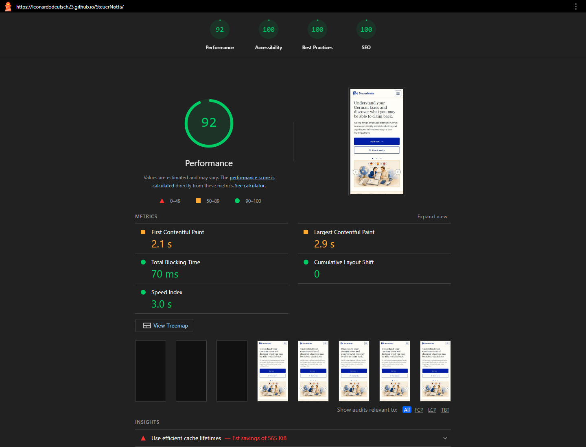

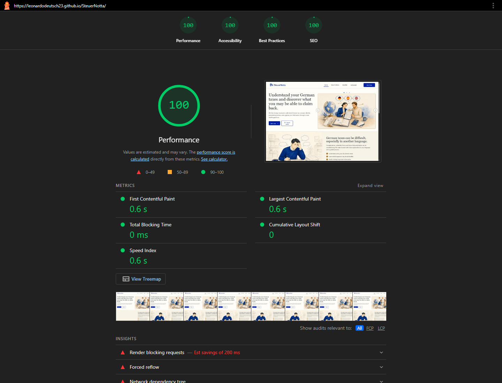

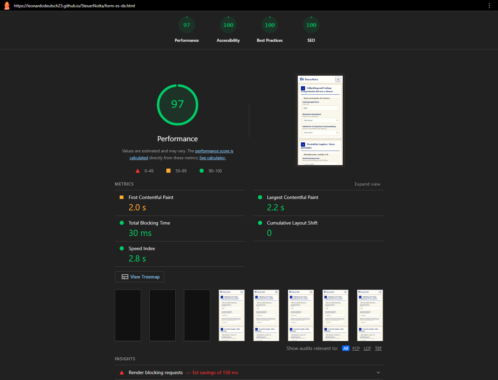

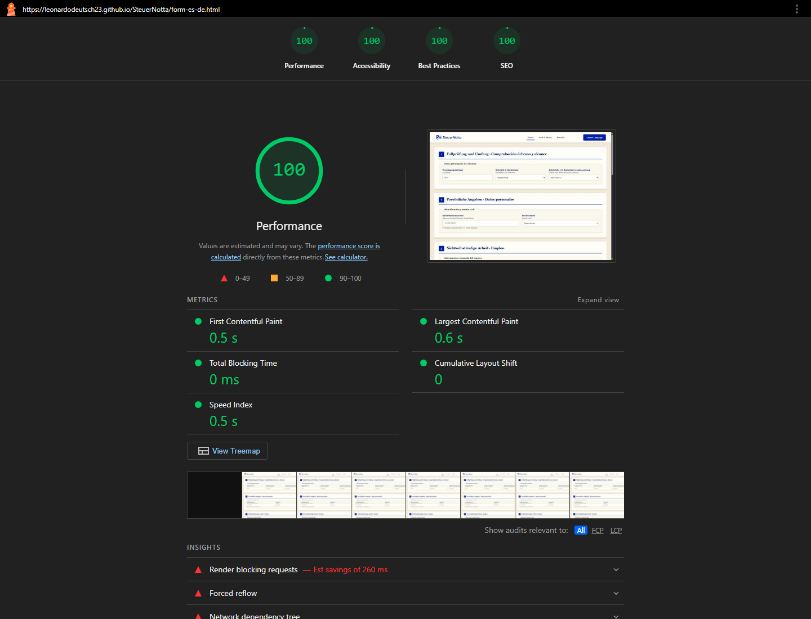

The homepage mobile performance score remains the lowest result and is primarily associated with
large illustrations and cache-lifetime opportunities. Accessibility, best-practices and SEO passed
at 100 in every recorded run.

## Bugs fixed during testing

| Bug | Cause | Fix | Retest |
|---|---|---|---|
| Internal form links opened new tabs | Language-card links used `target="_blank"` | Removed the attribute from all three links | Pass |
| Fixed navbar covered destination headings | Fragment navigation aligned sections to the viewport edge | Added suitable scroll offsets | Pass |
| Mobile menu remained open after navigation | Bootstrap collapse state was not changed by in-page links | Added the small adapted collapse script | Pass |
| Active section could be incorrect | Scrollspy offset and section positions disagreed | Aligned navigation target/offset behaviour | Pass |
| Tablet and desktop fields were uneven | Mixed content heights affected grid alignment | Applied shared grid and alignment rules | Pass |
| Marital-status control sat below the tax-ID control | The helper note changed the available flex-column height | Scoped both controls to start directly below their labels | Pass |
| Unpaired items stayed in the left column | Grid placement had no last-item exception | Centred unpaired tablet/desktop items | Pass |
| Problem illustration cropped unpredictably | One image source was forced across dissimilar aspect ratios | Added viewport-specific picture sources | Pass |
| Desktop navigation CTA extended too far right | Its responsive left margin was excessive | Reduced the responsive margin and remeasured | Pass |
| Form scope was impractical to test | The early draft contained over 300 controls | Reduced all routes to 12 representative matching controls | Pass |

## Known limitations

- There is no connected form processing, calculation, storage or transmission.
- Selecting a file only displays the browser's local selection; it is not uploaded.
- Reset and review actions remain disabled.
- Native validation messages and native controls vary by browser.
- Fiscal terminology and translations still require the future professional review tracked in
  [Issue #13](https://github.com/leonardodeutsch23/SteuerNotta/issues/13).
- Optimising the largest homepage illustrations is a future performance improvement.
